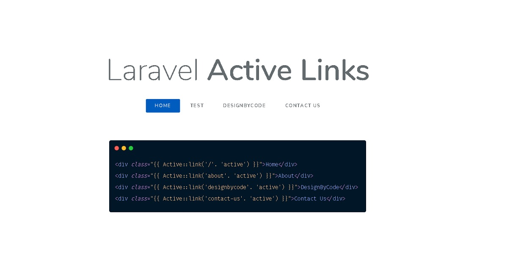

# Active Links


## Introduction to active links
__Active links__ is a easy way to set a __active__ class to any link on you page and body class to each page.

[](https://packagist.org/packages/designbycode/active-links)
[](https://packagist.org/packages/designbycode/active-links)
[](https://packagist.org/packages/designbycode/active-links)
[](https://packagist.org/packages/designbycode/active-links)
[](https://packagist.org/packages/designbycode/active-links)


### Install with composer
```
$ composer require designbycode/active-links
```



### Active an class of active for links
Add active class to any any link or element. 
```php
<a href="{{ url('/') }}" class='{{ Active::link('/') }}'>Home</a>
or
<a href="{{ url('/') }}" class='{{ active_link('/') }}'>Home</a>
```
Add custom active classes or change the helpers config file for global changes.

```php
<a href="{{ url('/') }}" class='{{ Active::link('/', 'active open' ) }}'>Home</a>
or
<a href="{{ url('/') }}" class='{{ active_link('/', 'active open') }}'>Home</a>
```
### Active html body class to route name and route name with body prefix

```html 
// Example
// <body class="body body-home home">
```

```php
<body class="{{ Active::bodyClass() }}">
    ...
<body class="{{ set_body() }}">
    ...
```

Classes can be added or remove passing 2 arrays. The first array will add classes and the second array will exclude classes. 
```php
<body class="{{ Active::bodyClass(['foo', 'bar'], ['body', 'foo-bar']) }}">
    ...
<body class="{{ set_body(['foo', 'bar'], ['body', 'foo-bar']) }}">
    ...
```

### Config Helpers
Run the following command to publish config helpers to set global class names.
```
php artisan vendor:publish --provider=DesignByCode\Helpers\Providers\HelpersServiceProvider
```

## License

Laravel UI is open-sourced software licensed under the [MIT license](https://opensource.org/licenses/MIT).
